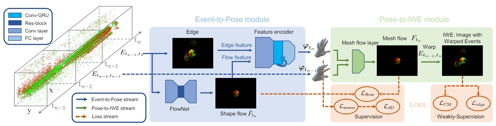

# EvHandPose [TPAMI'24] :hand: :hand:

*This is the official code of "EvHandPose: Event-based 3D Hand Pose Estimation with Sparse Supervision".*

[[:page_with_curl:Project Page](https://alanjiang98.github.io/evhandpose.github.io/)]  [[Data](https://www.dropbox.com/scl/fo/fknqrn1jb2bh9088gqw8w/AFiaujVeKt36ee2Roc8q8VE?rlkey=21atcy255w45z3du2whz4uzpb&e=2&st=dfsiib22&dl=0)] [[Paper](https://ieeexplore.ieee.org/document/10478195)] 
[[Arxiv](https://arxiv.org/abs/2303.02862)]
[[Model](https://www.dropbox.com/scl/fi/bfeac5l6htbnpue473xdk/model.ckpt)]
[[:movie_camera:Video](https://www.youtube.com/watch?v=MMaYhK2czIg)]




## 1. Installation
Clone this repository and install dependencies.
- create an environment
    ```
    conda env create -f environment.yml
    conda activate EvHand_public
    ```

## 2. Dataset Preparation
### 2.1. EvRealHands Dataset
- Our real-world dataset is from [EvRealHands](https://www.dropbox.com/scl/fo/fknqrn1jb2bh9088gqw8w/AFiaujVeKt36ee2Roc8q8VE?rlkey=21atcy255w45z3du2whz4uzpb&e=2&st=dfsiib22&dl=0).
Please download our dataset to your disk. We use ```$data$``` to represent the absolute path to our dataset.

### 2.2. MANO
- Please download MANO models from [MANO](https://mano.is.tue.mpg.de/download.php).
Put the ```MANO_LEFT.pkl``` and ```MANO_RIGHT.pkl``` to ```data/smplx_model/mano```.

## 3. Training
- Our training process consists of three steps. First, we train FlowNet under supervision with the flow loss,
and fix its parameters in the following steps. Then, we train our model under fully supervision to get reasonable 
good parameter initialization. Finally, we train our model with both labeled data and unlabeled data under semi 
supervision. 

- We will introduce our training process as follows. Please refer to our [paper](https://arxiv.org/html/2303.02862v3) for more details about our training strategy.

### 3.1. FlowNet Training
- First, set the values in ```configs/train_flow.yml``` as follows:
    - Set the ```exper.output_dir``` to your output flow model path. We use ```$output_flow_model_path$``` to represent the output path of our flow model;
    - Set the ```data.smplx_path``` to your MANO model path;
    - Set the ```data.data_dir``` to ```$data$```.

- Second, run the following script:
    ```
    cd ./scripts
    python train.py --config ../configs/train_flow.yml --gpus 1
    ```

We train 20 epochs in our experiments.

### 3.2. Fully-Supervised Training
- First, set the values in ```configs/train_supervision.yml``` as follows:
    - Set the ```exper.output_dir``` to your output path. We use ```$output_fully_supervision_model_path$``` to represent the output path of our fully supervision model;
    - Set the ```data.smplx_path``` to your MANO model path;
    - Set the ```data.data_dir``` to ```$data$```.

- Second, run the following script:
    ```
    cd ./scripts
    python train.py --config ../configs/train_supervision.yml --gpus 1 --flow_model_path $output_flow_model_path$/last.ckpt
    ```

We train 40 epochs in our experiments.

### 3.3. Semi-Supervised Training
- We use ```$output_semi_supervision_model_path$``` to represent the output path of our semi supervision model; run the following script:

    ```
    cd ./scripts
    python train.py --config ../configs/train_supervision.yml --gpus 1 
    --model_path $output_fully_supervision_model_path$/last.ckpt --config_merge ../configs/train_semi.yml
    ```

We train 40 epochs in our experiments.

## 4. Inference
- Set the values in ```configs/eval.yml``` as follows:

    - Set the ```exper.data_dir``` to ```$data$```.

    - For inference, we provide quantitative results of MPJPE and PA-MPJPE in ```scripts/eval.py```.

    - You can also get predicted mesh, 3d joints, image with warped events, .etc by setting the  ```log.save_result=True```
in  ```configs/eval.yml```.

- Then, run the following script:
    ```
    cd ./scripts
    python eval.py --config_train $output_semi_supervision_model_path$/train.yml --config_test ../configs/eval.yml
    --gpu 1 --model_path $output_semi_supervision_model_path$/last.ckpt 
    ```

    - The output results will be saved in ```$output_semi_supervision_model_path$/test```.

- If you want to directly implement Inference without training, we also provide [pretrained flow model and final semi-supervision model](https://www.dropbox.com/scl/fi/bfeac5l6htbnpue473xdk/model.ckpt?rlkey=zfqfjdjyvqvqbrlustv23of0l&e=1&st=zk1d9oc1&dl=0)
in this link. To directly implement Inference, you need to set ```method.flow.model_path=$Your_Pretrained_Flow_Model_Path$``` in ```configs/pretrain.yml```. You also need to set ```data.data_dir```, ```data.smplx_path```, ```exper.output_dir``` to your own setting. Then, run the following script:
    ```
    cd ./scripts
    python eval.py --config_train ../configs/pretrain.yml --config_test ../configs/eval.yml
    --gpu 1 --model_path $Your_Pretrained_Model_Path$ 
    ```
 Then you can directly view the results.

## 5. Citation
```bibtex
@article{jiang2024evhandpose,
  author    = {Jianping, Jiang and Jiahe, Li and Baowen, Zhang and Xiaoming, Deng and Boxin, Shi},
  title     = {EvHandPose: Event-based 3D Hand Pose Estimation with Sparse Supervision},
  journal   = {TPAMI},
  year      = {2024},
}

@inproceedings{Jiang2024EvRGBHand,
      title={Complementing Event Streams and RGB Frames for Hand Mesh Reconstruction}, 
      author={Jiang, Jianping and Zhou, Xinyu and Wang, Bingxuan and Deng, Xiaoming and Xu, Chao and Shi, Boxin},
      booktitle={CVPR},
      year={2024}
}
```

## 6. Acknowledgement
- In our experiments, we use the official code of [EventHands](https://github.com/r00tman/EventHands), [MobRecon](https://github.com/SeanChenxy/HandMesh), [EV-Transfer](https://github.com/uzh-rpg/rpg_ev-transfer), [NGA](https://github.com/SensorsINI/ECCV_network_grafting_algorithm) for comparison.

## 7. Related Projects
- [Complementing Event Streams and RGB Frames for Hand Mesh Reconstruction](https://alanjiang98.github.io/evrgbhand.github.io/)
- [EvPlug: Learn a Plug-and-Play Module for Event and Image Fusion](https://arxiv.org/abs/2312.16933)
